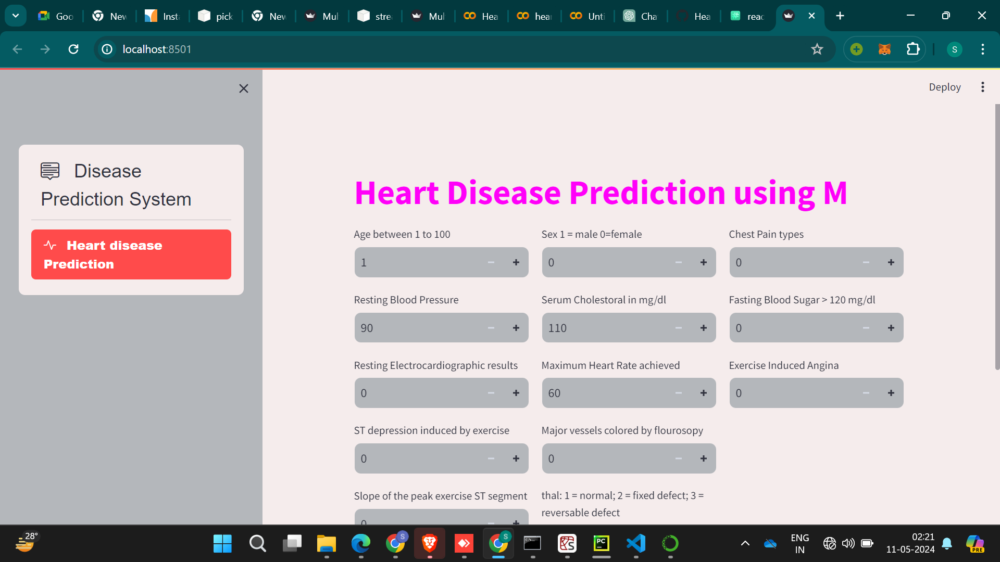

# Heart Attack Analysis Prediction

#### Heart Attack Analysis &amp; Prediction model created for DataTalks.Club mlzoomcamp course midterm project

It is classification model created to predict whether the patient has chance of getting heart attack or not based on the clinical parameters. Deployed in streamlit cloud.
Created using Kaggle noteboook

Dataset: 

Kaggle link:  

Link to access streamlit:  

Deployment Link: 

## Introduction

Heart disease is a major health concern worldwide, accounting for a significant number of deaths each year. Early detection and prevention are crucial in managing this condition. Machine learning models offer a promising approach to predicting the likelihood of heart attacks based on clinical parameters. In this study, we have developed a classification model to predict whether a patient is at risk of experiencing a heart attack based on their clinical parameters.

## Problem Statement

The aim of this study is to develop a reliable classification model that can predict the likelihood of a patient experiencing a heart attack based on their clinical parameters. By accurately identifying individuals at risk, healthcare providers can intervene early with targeted interventions and lifestyle modifications to reduce the risk of heart disease and improve patient outcomes.

**Code flow**

        * Data processing
        * EDA
        * Feature Engineering
        * Scaling and Normalization
        * Model Selection and Evaluation
        * Test the model
        * Deploying the model

**Data**

Input the below information to check whether the patient has risk of heart attack or not

Age : Age of the patient

Sex: The person’s sex (1 = male, 0 = female)

cp: chest pain type

— Value 0: asymptomatic

— Value 1: atypical angina

— Value 2: non-anginal pain

— Value 3: typical angina

trestbps: The person’s resting blood pressure (mm Hg on admission to the hospital)

chol: The person’s cholesterol measurement in mg/dl

fbs: The person’s fasting blood sugar (> 120 mg/dl, 1 = true; 0 = false)

restecg: resting electrocardiographic results

— Value 0: showing probable or definite left ventricular hypertrophy by Estes’ criteria

— Value 1: normal

— Value 2: having ST-T wave abnormality (T wave inversions and/or ST elevation or depression of > 0.05 mV)

thalach: The person’s maximum heart rate achieved

exang: Exercise induced angina (1 = yes; 0 = no)

oldpeak: ST depression induced by exercise relative to rest (‘ST’ relates to positions on the ECG plot. See more here)

slope: the slope of the peak exercise ST segment — 0: downsloping; 1: flat; 2: upsloping

ca: The number of major vessels (0–3)

thal: A blood disorder called thalassemia 

Value 0: NULL (dropped from the dataset previously

Value 1: fixed defect (no blood flow in some part of the heart)

Value 2: normal blood flow

Value 3: reversible defect (a blood flow is observed but it is not normal)

target: Heart disease (1 = no, 0= yes)

## Things implemented

- Exploratory Data Analysis
- Finding **Mutual information** with the target feature
- Applying **Decision tree classification, Random forest classifiaction and XGB classification** algorithms with different feature parameters and picking up the best model based on AUC score and accuracy
- Used **Matplotlib and Seaborn Heatmap** for visualization
  
## Deploying model

* Implemented the model in **Streamlit**.
* XGB Model will predict whether a patient is at risk of experiencing a heart attack based on their clinical parameters.

## Things to try it out next!
* Applying crossvalidation concepts in model training
* Applying Pipeline concepts in model training
* Trying out other Feature selection methods
* Using Z scores to treat outliers
* Applying other classification algorithms
* Implementing more EDA concepts

## References:

https://towardsdatascience.com/heart-disease-uci-diagnosis-prediction-b1943ee835a7
